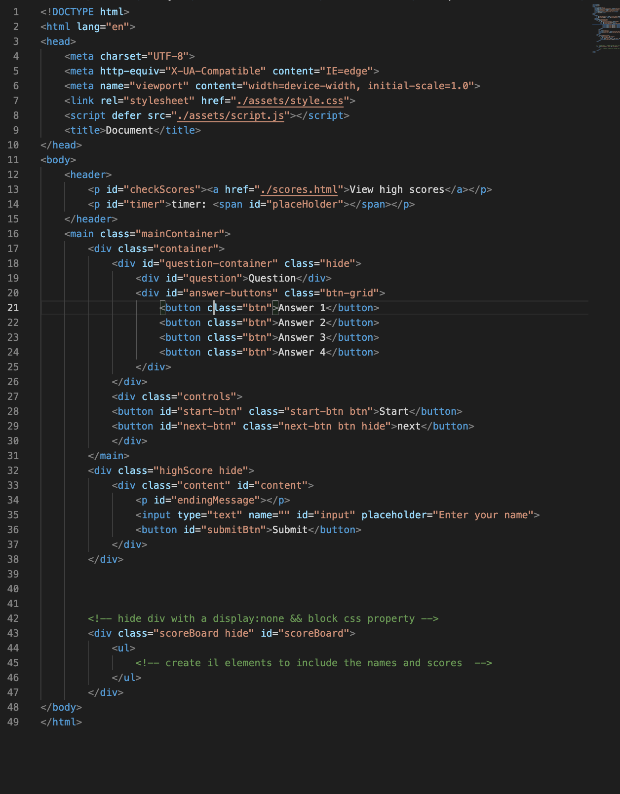
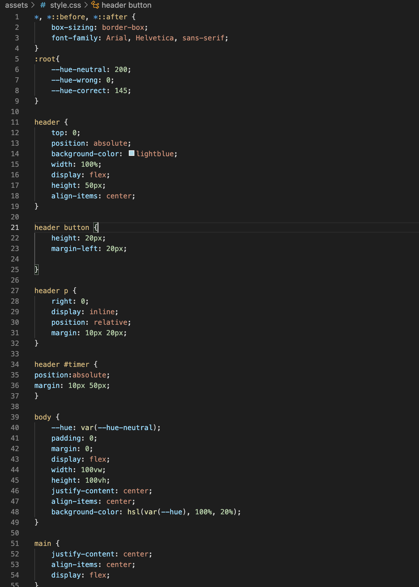
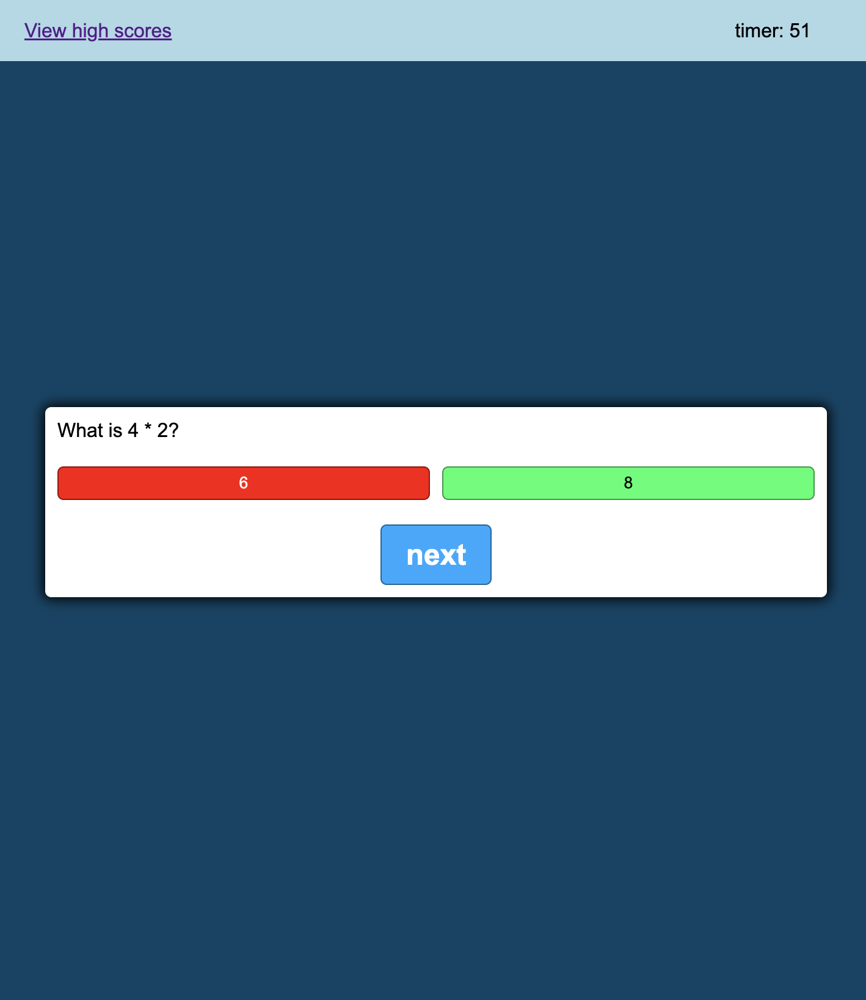

# Code Quiz

## Description

Welcome to the Code Quiz web application. This quiz appliacation is a combination of HTML, CSS and JavaScript technologies aiming to test the user's knowlege, focus and pressure control. 

* As the user starts the quiz, a countdown is set off.
* As the user answers a question incorrectly, time is subtracted from score.

The goal of the game is to answer as many questions correctly in the shortest ammount of time. Players are then prompted to enter their initials to registrate their performace in relation to other players.

## Instructions

* Press button to start the quiz
* Answer each question by selecting the choice you believe is the correct one
* After you are done with the quiz, input your initials to register your performance.

## Contributers

* Paulo Oliveira

## Links and previews

HTML Screen-shot

CSS Screen-shot

Website Screen-shot

